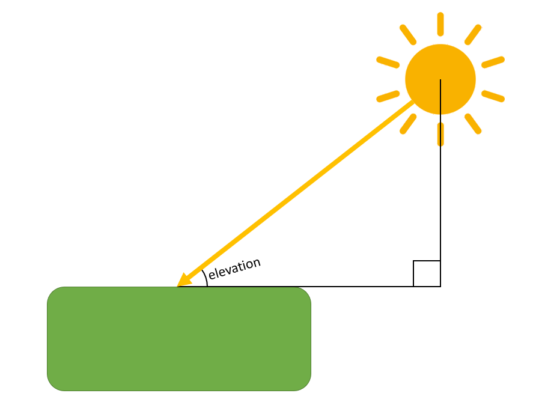
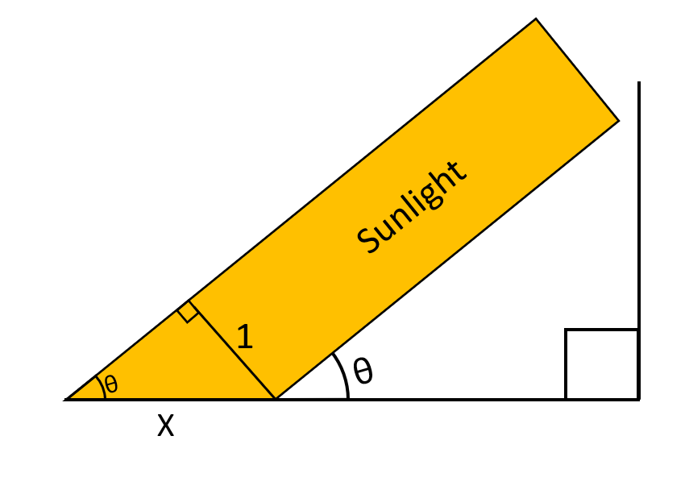

```{r setup, include=FALSE}
knitr::opts_chunk$set(echo = TRUE, cache = TRUE, dpi=300)
```


```{r packages, cache=F, message=F}
## Load and install the packages that we'll be using today
if (!require("pacman")) install.packages("pacman")
pacman::p_load(tidyverse, shiny)
## My preferred ggplot2 plotting theme (optional)
theme_set(theme_minimal())
```


```{r functions, include=FALSE}
elevation = function(t, Latitude, Longitude, year, day){
  #Converting the year and day to Julian Day and Century. 2454466.5 is
  #12:00 AM of Jan 1 2008. Using mid day as the average 2454467 is Jan 1 2008
  #ifelse(year == 2008, JulianDay = 2454466+day, JulianDay = 2454467+day+(year-2008)*365);
  JulianDay = 2454466+day;
  ##Calculate solar position constants for the day in question. These
  ##functions were obtained from an NOAA Solar Calculations spreadsheet.
  ##Note: the variation seen throughout a given day is so small that we can
  ##treat these as constants. More on this later.
  JulianCentury = (JulianDay-2451545)/36525;
  GeomMeanLongSunDeg = (280.46646+JulianCentury*(36000.76983+JulianCentury*.0003032))%%360;
  GeomMeanAnomSunDeg = 357.52911+JulianCentury*(35999.05029 - 0.0001537*JulianCentury);
  EccentEarthOrbit = 0.016708634-JulianCentury*(0.000042037+0.0000001267*JulianCentury);
  SunEqOfCtr = sin(pi/180*(GeomMeanAnomSunDeg))*(1.914602-JulianCentury*(0.004817+0.000014*JulianCentury))+sin(pi/180*(2*GeomMeanAnomSunDeg))*(0.019993-0.000101*JulianCentury)+sin(pi/180*(3*GeomMeanAnomSunDeg))*0.000289;
  SunTrueLongDeg = GeomMeanLongSunDeg+SunEqOfCtr;
  SunAppLongDeg = SunTrueLongDeg-0.00569-0.00478*sin(pi/180*(125.04-1934.136*JulianCentury));
  MeanObliqEclipticDeg = 23+(26+((21.448-JulianCentury*(46.815+JulianCentury*(0.00059-JulianCentury*0.001813))))/60)/60;
  ObliqCorrDeg = MeanObliqEclipticDeg+0.00256*cos(pi/180*(125.04-1934.136*JulianCentury));
  SunDeclineDeg = 180/pi*(asin(sin(pi/180*(ObliqCorrDeg))*sin(pi/180*(SunAppLongDeg))));
  vary = tan(pi/180*(ObliqCorrDeg/2))*tan(pi/180*(ObliqCorrDeg/2));
  EqOfTimeMinutes = 4*180/pi*(vary*sin(2*pi/180*(GeomMeanLongSunDeg))-2*EccentEarthOrbit*sin(pi/180*(GeomMeanAnomSunDeg))+4*EccentEarthOrbit*vary*sin(pi/180*(GeomMeanAnomSunDeg))*cos(2*pi/180*(GeomMeanLongSunDeg))-0.5*vary*vary*sin(4*pi/180*(GeomMeanLongSunDeg))-1.25*EccentEarthOrbit*EccentEarthOrbit*sin(2*pi/180*(GeomMeanAnomSunDeg)));
  
  ## Define maximum PAR: Solar Constant*.487(%of radiation that makes up PAR)*scale(100)/Sin(90)
  MaxPAR=.487*1361*100;
  srssangle = 90;
  HAval = cos(pi/180*(srssangle))/(cos(pi/180*(Latitude))*cos(pi/180*(SunDeclineDeg)))-tan(pi/180*(Latitude))*tan(pi/180*(SunDeclineDeg));
  if (HAval <= -1){
    HASunriseDeg = 180
  } else if (HAval >= 1) {
    HASunriseDeg = 0
  } else {
    HASunriseDeg = 180/pi*acos(HAval)
  }
  SunlightDuration = HASunriseDeg/180;
  
  A = sin(Latitude*pi/180)*sin(SunDeclineDeg*pi/180);
  B = cos(Latitude*pi/180)*cos(SunDeclineDeg*pi/180);
  
  SolarNoon = (720-4*Longitude-EqOfTimeMinutes+0*60)/1440;
  Sunrise <<- ((SolarNoon*1440-HASunriseDeg*4)/1440)%%1; #keep sunrise positive and between zero and 1
  Sunset <<- Sunrise+SunlightDuration; #assign SR/SS to global for use in other functions
  
  C = EqOfTimeMinutes/4+Longitude;
  
  return(90-(acos(A+B*cos((t*360+C+180)*pi/180)))*180/pi)
  
}

add_wang = function(time_ele_PAR, SS, observations) {
  
  wang_index = observations %>%
    select(time, elevation, PAR)
  
  wang_index = SS %>%
    select(time, elevation, PAR) %>%
    rbind(wang_index, .)
  
  wang_calculation = time_ele_PAR
  
  SS = SS %>%
    mutate(
      slot1f = ceiling(time * 8 * precision + 1),
      slot1c = ceiling(slot1f / precision) * precision,
      slot2c = floor(SS$time * 8 * precision + 1),
      slot2f = floor(slot2c / precision) * precision + 2
    )
  
  #fill obs 1 forward and obs 2 backwards (so obs 1 is the most recent and obs 2 in the soonest)
  
  for (i in 1:4) {
    wang_calculation$obs1[SS$slot1f[i]:SS$slot1c[i]] = 17 + i
    wang_calculation$obs2[SS$slot2f[5 - i]:SS$slot2c[5 - i]] = 17 + 5 - i
  }
  
  
  wang_calculation = wang_calculation %>%
    mutate(
      wang_i_PAR1 = wang_index$PAR[wang_calculation$obs1],
      wang_i_PAR2 = wang_index$PAR[wang_calculation$obs2],
      wang_i_time1 = wang_index$time[wang_calculation$obs1],
      wang_i_time2 = wang_index$time[wang_calculation$obs2],
      wang_i_sunrise1 = time > ((Sunrise + Sunset - 1) / 2),
      wang_i_sunrise2 = time > ((Sunrise + Sunset + 1) / 2),
      wang_i_sunrise3 = time > ((Sunrise + Sunset + 3) / 2),
      wang_i_dayduration = Sunset - Sunrise
    )
  
  wang_calculation = wang_calculation %>%
    mutate(wang_i_sunrise = wang_i_sunrise1 + wang_i_sunrise2 + wang_i_sunrise3 + Sunrise - 1) %>%
    select(-wang_i_sunrise1,-wang_i_sunrise2,-wang_i_sunrise3)
  
  wang_calculation = wang_calculation %>%
    mutate(
      PAR1 = wang_i_PAR1 * sin((time - wang_i_sunrise) * pi / wang_i_dayduration)
      / sin((wang_i_time1 - wang_i_sunrise) * pi / wang_i_dayduration),
      PAR2 = wang_i_PAR2 * sin((time - wang_i_sunrise) * pi / wang_i_dayduration)
      / sin((wang_i_time2 - wang_i_sunrise) * pi / wang_i_dayduration),
      ratio_1 = (wang_i_time2 - time) / (wang_i_time2 - wang_i_time1),
      ratio_2 = (time - wang_i_time1) / (wang_i_time2 - wang_i_time1),
      wang_PAR = ratio_1*PAR1 + ratio_2*PAR2)
  
  #filter out observations with a SR as the first observation. Then calculate PAR from second observation using 6.2
  
  SR_adjust = wang_calculation %>%
    filter(obs1 == 17 + iSR | obs1 == 19 + iSR) %>%
    mutate(wang_PAR_SR = PAR2)
  
  # set PAR with times where SR is the second observation to 0
  
  SR_adjust_e = wang_calculation %>%
    filter(obs2 == 17 + iSR | obs2 == 19 + iSR) %>%
    mutate(wang_PAR_SR = 0)
  
  #combine SR_adjust tables
  
  SR_adjust = rbind(SR_adjust, SR_adjust_e)
  
  #Insert SR_adjust into wang_calculation
  
  wang_calculation = right_join(SR_adjust, wang_calculation)
  wang_calculation$wang_PAR[!is.na(wang_calculation$wang_PAR_SR)] = wang_calculation$wang_PAR_SR[!is.na(wang_calculation$wang_PAR_SR)]
  
  
  #filter out observations with a SS as the second observation. Then calculate PAR from first observation using 6.2
  
  SS_adjust = wang_calculation %>%
    filter(obs2 == 18 + iSR |
             obs2 == 16 + (iSR + 3) %% 5 + iSR) %>%
    mutate(wang_PAR_SS = PAR1)
  
  # set PAR with times where SS is the first observation to 0
  
  SS_adjust_e = wang_calculation %>%
    filter(obs1 == 18 + iSR |
             obs1 == 16 + (iSR + 3) %% 5 + iSR) %>%
    mutate(wang_PAR_SS = 0)
  
  #combine SR_adjust tables
  
  SS_adjust = rbind(SS_adjust, SS_adjust_e)
  
  #Insert SS_adjust into wang_calculation
  
  wang_calculation = right_join(SS_adjust, wang_calculation)
  wang_calculation$wang_PAR[!is.na(wang_calculation$wang_PAR_SS)] = wang_calculation$wang_PAR_SS[!is.na(wang_calculation$wang_PAR_SS)]
  
  #day of no observations
  
  no_obs_adjust = wang_calculation %>%
    filter(obs1 > 17 & obs2 > 17) %>%
    mutate(wang_PAR_no = NaN)
  
  #Insert no_obs_adjust
  
  wang_calculation = right_join(no_obs_adjust, wang_calculation)
  wang_calculation$wang_PAR[!is.na(wang_calculation$wang_PAR_no)] = wang_calculation$wang_PAR_no[!is.na(wang_calculation$wang_PAR_no)]
  
  
  
  i = 0:16 * precision + 1
  wang_calculation$wang_PAR[i] = wang_calculation$PAR[i]
  return(wang_calculation$wang_PAR)
}

add_ratio = function(time_ele_PAR, SS, observations) {
  #check observations. If both light then take average of ratios. Else take the ratio of the one with light.
  ratio_index = observations %>%
    select(time, elevation, ratioMax)
  
  ratio_calc = time_ele_PAR
  
  ratio_calc = time_ele_PAR %>%
    mutate(
      rat1 = ratio_index$ratioMax[ratio_calc$obs1],
      rat2 = ratio_index$ratioMax[ratio_calc$obs2],
      time1 = ratio_index$time[ratio_calc$obs1],
      time2 = ratio_index$time[ratio_calc$obs2],
      linear_ratio =  rat1*(time2-time)/(time2-time1)+rat2*(time-time1)/(time2-time1)
    )
  
  #identify SR/SS slots
  
  SS = SS %>%
    mutate(
      slot1f = ceiling(time * 8 * precision + 1),
      slot1c = ceiling(slot1f / precision) * precision,
      slot2c = floor(SS$time * 8 * precision + 1),
      slot2f = floor(slot2c / precision) * precision + 2
    )
  
  #fill obs 1 forward and obs 2 backwards (so obs 1 is the most recent and obs 2 in the soonest)
  
  for (i in 1:4) {
    ratio_calc$obs1[SS$slot1f[i]:SS$slot1c[i]] = 17 + i
    ratio_calc$obs2[SS$slot2f[5 - i]:SS$slot2c[5 - i]] = 17 + 5 - i
  }
  
  #filter out observations with a SR as the first observation. Then use ratio from second observation
  
  SR_adjust1 = ratio_calc %>%
    filter(time>5)
  SR_adjust2 = ratio_calc %>%
    filter(time>5)
  
  if(SS_ele[iSR] == 0){
    SR_adjust1 = ratio_calc %>%
      filter(obs1 == 17 + iSR) %>%
      mutate(linear_ratio_SR = rat2)
  }
  
  if(SS_ele[iSR+2] == 0){
    SR_adjust2 = ratio_calc %>%
      filter(obs1 == 19 + iSR) %>%
      mutate(linear_ratio_SR = rat2)
  }
  
  # set PAR with times where SR is the second observation to 0
  
  SR_adjust_e = ratio_calc %>%
    filter(obs2 == 17 + iSR | obs2 == 19 + iSR) %>%
    mutate(linear_ratio_SR = 0)
  
  #combine SR_adjust tables
  
  SR_adjust = rbind(SR_adjust1, SR_adjust2, SR_adjust_e)
  
  #Insert SR_adjust into ratio_calc
  
  ratio_calc = right_join(SR_adjust, ratio_calc)
  ratio_calc$linear_ratio[!is.na(ratio_calc$linear_ratio_SR)] = ratio_calc$linear_ratio_SR[!is.na(ratio_calc$linear_ratio_SR)]
  
  
  #filter out observations with a SS as the second observation. Then use ratio from first observation
  
  SS_adjust1 = ratio_calc %>%
    filter(time>5)
  SS_adjust2 = ratio_calc %>%
    filter(time>5)
  
  if(SS_ele[iSR+1] == 0){
    SS_adjust1 = ratio_calc %>%
      filter(obs2 == 18 + iSR) %>%
      mutate(linear_ratio_SS = rat1)
  }
  
  if(SS_ele[(iSR+3) %% 5 + iSR-1] == 0){
    SS_adjust2 = ratio_calc %>%
      filter(obs2 == 16 + (iSR + 3) %% 5 + iSR) %>%
      mutate(linear_ratio_SS = rat1)
  }
  
  
  
  # set PAR with times where SS is the first observation to 0
  
  SS_adjust_e = ratio_calc %>%
    filter(obs1 == 18 + iSR |
             obs1 == 16 + (iSR + 3) %% 5 + iSR) %>%
    mutate(linear_ratio_SS = 0)
  
  #combine SR_adjust tables
  
  SS_adjust = rbind(SS_adjust1, SS_adjust2, SS_adjust_e)
  
  #Insert SS_adjust into ratio_calc
  
  ratio_calc = right_join(SS_adjust, ratio_calc)
  ratio_calc$linear_ratio[!is.na(ratio_calc$linear_ratio_SS)] = ratio_calc$linear_ratio_SS[!is.na(ratio_calc$linear_ratio_SS)]
  
  #day of no observations
  
  no_obs_adjust = ratio_calc %>%
    filter(obs1 > 17 & obs2 > 17) %>%
    mutate(obs_no = NaN)
  
  #Insert no_obs_adjust
  
  ratio_calc = right_join(no_obs_adjust, ratio_calc)
  ratio_calc$linear_ratio[!is.na(ratio_calc$obs_no)] = ratio_calc$obs_no[!is.na(ratio_calc$obs_no)]
  
  
  i = 0:16 * precision + 1
  ratio_calc$linear_ratio[i] = ratio_calc$ratioMax[i]
  
  return(ratio_calc$linear_ratio)
}
```
## Introduction

In this document I will outline my methods used for calculating daily totals of photosynthetically active radiation (PAR) at a given location from incident PAR values. Photosnythetically active radiation is solar radiation in the 400-700 nm spectral range which plants can use for photosynthesis. The data I use is the GLASS PAR product sourced from the Global Land Cover Facility. The GLASS PAR product had 5km and 3 hour spatial and temporal resolution and contained incident radiation values from 2008-2010. The citation for this data is:(insert a click to show button) Shunlin Liang, Xiaotong Zhang. Global Land Surface Products: Photosynthetically Active Radiation Data Collection(2008-2010). Bejing Normal University, 2012. doi:10.6050/glass863.3005.db

## Existing methods

There already exist methods for calculating daily PAR values. Liang et al. (Liang S., Zhang X., Xiao Z., Cheng J., Liu Q., Zhao X. (2014) Incident Photosynthetic Active Radiation. In: Global LAnd Surface Satellite (GLASS) Products. SpringerBriefs in Earth Sciences. Springer, Cham) has published a book containing algorithims for a variety of different GLASS products. Chapter 6 focuses on calculating daily PAR from the dataset we are using. They cite Wang et al. (2010) with the algorithms they use. Given any observed instantaneous PAR $InstPAR(T_{overpass})$ at time $T_{overpass}$ they interpolate to calculate $InstPAR(t)$ at any time of day with:

$$InstPAR(t)=InstPAR(T_{overpass}) \cfrac{\sin(\frac {(t-T_{sunrise)}*\pi}{T_{sunset}-T_{sunrise}})}{\sin(\frac {(T_{overpass}-T_{sunrise)}*\pi}{T_{sunset}-T_{sunrise}})}$$

After obtaining the PAR at any time they can integrate from sunrise to sunset to calculate the PAR for the day. If there is more than one observation in the day then they calculate $InstPAR(t)$ as follows (quoted from liang et al.):

Consider an example of two observations within one day at $T_1$ and $T_2$ respectively. From sunrise to $T_1$, PAR takes on the value of $InstPAR_{T_1}(t)$, and from $T_2$ to sunset, PAR has the value of $InstPAR_{T_2}(t)$. Between $T_1$ and $T_2$, the PAR value is calculated by the weighted average of two sinusoidally interpolated values:
 
$$InstPAR(t) = \cfrac{T_2-t}{T_2-T_1} InstPAR_{T_1}(t)+\cfrac{t-T_1}{T_2-T_1} InstPAR_{T_2}(t)$$

These algorithms work great especially near the equator between sunrise and sunset. However, when applying these algorithms to the dataset I noticed irregularities in the polar regions and in areas and times where there was an observation very close to sunrise or sunset. In the next section I will describe the mechanics of how PAR is transmitted from the sun to the surface of the earth and how that confirms my hesitations when applying these algorithms.

## PAR mechanics

```{r diagram1, out.width='60%', fig.align='center', echo=FALSE}

```

```{r diagram2, out.width='40%', fig.align='center', echo=FALSE}

```

We know that the amount of radiation emmited from the sun, the solar constant, is 1361 watts per square meter on a surface perpendicluar to the rays. Since this is a constant that implies that there is a limit to the amount of radiation a square meter on earth recieves and that it changes throughout the day. This is directly related to the elevation angle of the sun. Looking at the diagrams above it is clear that a ray of width 1 is projected to a length of x on the surface where $x = \frac {1}{\sin(\theta)}$. So, it follows that the amount of radiation that surface recieves is $\frac {1}{x} = \sin(elevation)$. Of course we have an atmosphere, ocassionally cloud cover and other obstacles which limit the fraction of this theoretically maximal amount of radiation that can reach the surface at any elevation.

The other concerning point about having observations near sunrise and sunset is that when radiation passes through the atmosphere it is refracted. Under standard temperature and pressure conditions refraction only adjusts apparent solar elevation by .6 degrees at around 0 degrees elevation and quickly and exponentially approaches 0 degrees of refraction. However, with spatial resolution as fine as we have in this data set that means every day we have observations that pick up positive PAR values before and after our calculated times for sunrise and sunset respectively. If we do not account for this and blindly plug our values into the algorithm provided above then our interpolated PAR values are negative.


## Ratio method

Generally we can estimate the incident PAR for unobserved times by taking a weighted average of the PAR ratios of the nearest observations and multiplying that by the sin of the sun's elevation angle. PAR ratios are calculated as incident value/sin(elevation angle). The weighted average being based on how close the unobserved incident is to the nearest values. So if there exists 2 observations at times $T_1$ and $T_2$ with $R_1$ and $R_2$ as the respective ratios, the estimated incident PAR at time $t$ where $T_1<t<T_2$ is $InstPAR(t) = (R_2 * \frac{t-T_1}{T_2-T_1}+R_1*\frac{T_2-t}{T_2-T_1})*\sin(elevation(t))$. We can estimate PAR between observations by integrating the above equation from $T_1$ to $T_2$ with respect to $t$, and because the calculation is linear we can separate them and calculate the contribution to daily PAR that each observation had separately.

Below I dissect the functional form of $\sin(elevation(t))$ based off NOAA's calculation of solar elevation.

$$\sin(elevation(t))=\sin(90-\arccos(\sin(Lat)*\sin(SunDecline)+\cos(Lat)*\cos(Sundecline)*\cos(t*360+EqOfTime/4+Lon+180))$$
$$=\cos(Arccos(\sin(Lat)*\sin(SunDecline)+\cos(Lat)*\cos(Sundecline)*-\cos(t*360+EqOfTime/4+Lon))$$
$$=\sin(Lat)*\sin(SunDecline)-\cos(Lat)*\cos(Sundecline)*\cos(t*360+EqOfTime/4+Lon)$$
Since SunDecline and EqOfTime are approximately constant during a given day and since Lat and Lon don't change at a location, if we set 

$\sin(Lat)*\sin(SunDecline)=A$,

$\cos(Lat)*\cos(Sundecline)=B$ and 

$EqOfTime/4+Lon=C$ we get 

$\sin(elevation(t))=A-B*\cos(t*360+C)$ with $A,B,C$ as day and location specific constants which makes the integration easy.

Because atmospheric refraction is a function of many variable factors the calculated sunset and sunrise times for a given latitude and longitude is not always the same as the first and last light. This problem reveals itself when we have a PAR observation before sunrise or after sunset. Refraction also becomes an issue when we have an observation just seconds after sunset where the sun may, due to refraction, appear to be up to a degree or so higher in the sky than where we calculate it to be. This can lead to calculated ratios higher than the theoretical maximum or negative ratio calculations. I meet these infrequent occurrances, which are easily identified, with a linear contingent plan. In these cases we ignore solar position and assume a linear relationship between the PAR of the troublesome observation and its neighboring observations. This is the same method used by the authors of the GLASS PAR data product for all observations. However, I believe my methods to be an improvement in cases where the ratio is well behaved (every time the observation occurs outside of sunrise and sunset times including most times near sunrise and sunset) as it is effectively the same estimator when the solar path takes the sun to a 90 degree elevation angle (only when the sun passes directly over a location), and a more accurate estimator as we get closer to the polar regions.

## Interactive plots

```{r fixed paramaters, echo=FALSE}
precision = 100

t = round(seq(0, 2, 1/(8*precision)), digits = 5)
```

``` {r input panel, cache=FALSE}
inputPanel(
  sliderInput("Latitude", label = "Latitude:",
              min = -90, max = 90, step = 1, value = 0),
  sliderInput("Longitude", label = "Longitude:",
              min = -180, max = 180, step = 1, value = 0),
  sliderInput("year", label = "Year:",
              min = 2000, max = 2050, step = 1, value = 2020),
  sliderInput("day", label = "Day:",
              min = 1, max = 365, step = 1, value = 1)
)
```

```{r output elevation, cache=FALSE}
renderPlot({
  ggplot(data = NULL, aes(x = 24*60*60*t, y = sin(elevation(t,input$Latitude,input$Longitude,input$year,input$day)*pi/180), color = sin(elevation(t,input$Latitude,input$Longitude,input$year,input$day)*pi/180), size = 3))+
    scale_color_viridis_c(option = "C",
                          rescaler =  function(x, to = NULL, from = NULL) {
                            ifelse(x<.2, 
                                   scales::rescale(x, from = c(0,.2), to = c(.45,.85)),
                                   scales::rescale(x, from = c(.2,1), to = c(.85,1)))
                            }) +
    coord_cartesian(ylim = c(-.1,1))+
    geom_point()+
    scale_x_time()
  })
```
## Data

Put but input and output data here.
