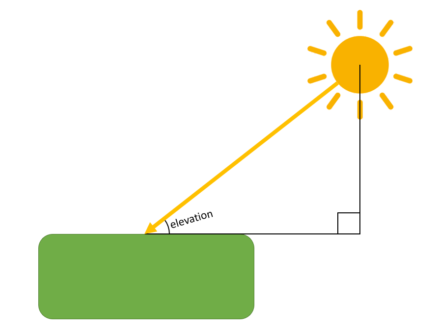
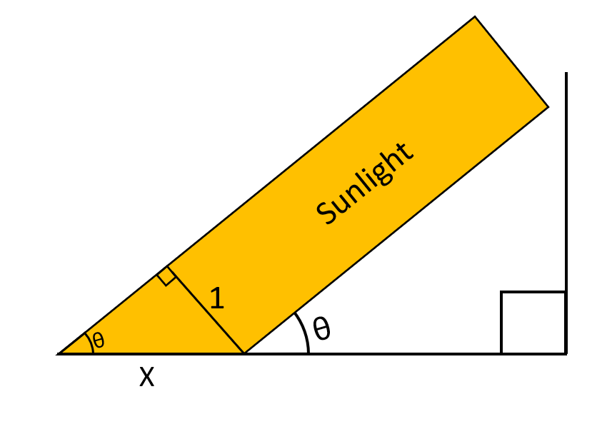

## Introduction

In this document I will outline my methods used for calculating daily totals of photosynthetically active radiation (PAR) at a given location from incident PAR values. Photosynthetically active radiation is solar radiation in the 400-700 nm spectral range which plants can use for photosynthesis. The data I use is the GLASS PAR product sourced from the Global Land Cover Facility. The GLASS PAR product has 5km and 3 hour spatial and temporal resolution and contains incident radiation values from 2008-2010^1.

## PAR mechanics

diagram of solar radiation

We know that the amount of radiation emitted from the sun, the solar constant, is 1361 watts per square meter on a surface perpendicular to the rays. Since this is a constant that implies that there is a limit to the amount of radiation a square meter on earth receives and that it changes throughout the day depending on the solar elevation angle. Consider the diagrams above, it is clear that a ray of width 1 (representing 1 solar constant) is projected to a length of x on the surface where $\small x = \frac {1}{\sin(\theta)}$. So, it follows that the maximal amount of radiation that a unit of area on the surface receives is $\small \frac {1}{x} = \sin(elevation)$. Of course, we have an atmosphere, occasionally cloud cover and other obstacles which attenuate the amount of radiation that can reach the surface. In this dataset we have observations every 3 hours. By dividing incident PAR by the theoretically maximum amount of PAR that could be received at a given elevation angle (the amount that would be received if there was no atmosphere or obstructions) we can calculate exactly what ratio of solar radiation that makes it to the surface. By calculating the ratio at each observation we have a measure of how much radiation is being filtered out throughout the day. We can then linearly interpolate those ratio values between observations to get an estimate of PAR between our observations.

## Ratio method

Generally, we can estimate the incident PAR for unobserved times by taking a weighted average of the PAR ratios of the nearest observations and multiplying that by the sin of the sun's elevation angle (remember $\small \frac {1}{x} = \sin(elevation)$). PAR ratios are calculated as incident value/sin(elevation angle). The weighted average being based on how close the unobserved incident is to the nearest values. So if there exists 2 observations at times $\small T_1$ and $\small T_2$ with $\small R_1$ and $\small R_2$ as the respective ratios, the estimated incident PAR at time $\small t$ where $\small T_1<t<T_2$ is $\small InstPAR(t) = (R_2 * \frac{t-T_1}{T_2-T_1}+R_1*\frac{T_2-t}{T_2-T_1})*\sin(elevation(t))$. We can estimate PAR between observations by integrating the above equation from $\small T_1$ to $\small T_2$ with respect to $\small t$, and because the calculation is linear we can separate them and calculate the contribution to daily PAR that each observation had separately.

If there is only one observation in the day or if $\small t$ falls between sunrise and the first observation or between the last observation an sunset then we just use the ratio for the nearest observation ($\small R_1$): $\small InstPAR(t) = R_1*\sin(elevation(t))$.

Below I dissect the functional form of $\small \sin(elevation(t))$ based off NOAA's calculation of solar elevation^2.

$$\small \sin(elevation(t))=\sin(90-\arccos(\sin(Lat)*\sin(SunDecline)+\cos(Lat)*\cos(Sundecline)*\cos(t*360+EqOfTime/4+Lon+180)))$$
$$\small \sin(elevation(t))=\cos(Arccos(\sin(Lat)*\sin(SunDecline)+\cos(Lat)*\cos(Sundecline)*-\cos(t*360+EqOfTime/4+Lon)))$$
$$\small \sin(elevation(t))=\sin(Lat)*\sin(SunDecline)-\cos(Lat)*\cos(Sundecline)*\cos(t*360+EqOfTime/4+Lon)$$
Since SunDecline and EqOfTime are approximately constant during a given day and since Lat and Lon don't change at a location, if we set 

  $\small \sin(Lat)*\sin(SunDecline)=A, \hspace{4pt}$ $\small \cos(Lat)*\cos(Sundecline)=B,\hspace{4pt}$ and $\small EqOfTime/4+Lon=C$

we get $\hspace{4pt} \small \sin(elevation(t))=A-B*\cos(t*360+C)$ where $\small A,B,C$ are day and location specific constants.

So, substituting that into our $\small instPAR(t)$ function we get:

$$\small InstPAR(t) = (R_2 * \frac{t-T_1}{T_2-T_1}+R_1*\frac{T_2-t}{T_2-T_1})*(A-B*\cos(t*360+C))$$
when there are daylight observations on either side of $\small t$. When there is only one daylight observation close to $\small t$ then:

$$\small InstPAR(t) = R_1*(A-B*\cos(t*360+C))$$

So, to calculate PAR for a given day at a specified location with $\small n$ daylight observations we integrate $\small InstPAR(t)$ from sunrise to sunset:

$$\small \int_{Sunrise}^{T_1} R_1*(A-B*\cos(t*360+C))dt + \int_{T_1}^{T_2} (R_2 * \frac{t-T_1}{T_2-T_1}+R_1*\frac{T_2-t}{T_2-T_1})*(A-B*\cos(t*360+C))dt +...$$
$$\small + \int_{T_{n-1}}^{T_n} (R_n *\frac{t-T_{n-1}}{T_n-T_{n-1}}+R_{n-1}*\frac{T_n-t}{T_n-T_{n-1}})*(A-B*\cos(t*360+C))dt + \int_{T_n}^{Sunset} R_n*(A-B*\cos(t*360+C))dt$$

## Existing methods

There already exist methods for calculating daily PAR values. Liang et al.^3 has published a book containing algorithms for a variety of different GLASS products. Chapter 6 focuses on calculating daily PAR from the dataset we are using. They cite Wang et al. (2010) with the algorithms they use. Given any observed PAR, $\small InstPAR(T_{overpass})$, at time $T_{overpass}$ they interpolate to calculate $\small InstPAR(t)$ at any time of day with:

$$\small InstPAR(t)=InstPAR(T_{overpass}) \cfrac{\sin(\frac {(t-T_{sunrise)}*\pi}{T_{sunset}-T_{sunrise}})}{\sin(\frac {(T_{overpass}-T_{sunrise)}*\pi}{T_{sunset}-T_{sunrise}})}$$

After obtaining the PAR at any time they can integrate from sunrise to sunset to calculate the PAR for the day. If there is more than one observation in the day then they calculate $\small InstPAR(t)$ as follows (quoted from Liang et al.):

Consider an example of two observations within one day at $\small T_1$ and $\small T_2$ respectively. From sunrise to $\small T_1$, PAR takes on the value of $\small InstPAR_{T_1}(t)$, and from $\small T_2$ to sunset, PAR has the value of $\small InstPAR_{T_2}(t)$. Between $\small T_1$ and $\small T_2$, the PAR value is calculated by the weighted average of two sinusoidally interpolated values:
 
$$\small InstPAR(t) = \cfrac{T_2-t}{T_2-T_1} InstPAR_{T_1}(t)+\cfrac{t-T_1}{T_2-T_1} InstPAR_{T_2}(t)$$

## Differences between methods

Navigate to the Plots page for a visual depiction of the similarities and differences between my ratio method and Wang et al.'s methods. You will notice that Wang et al.'s algorithm work great near the equator. However, the closer we get to the poles the more inaccurate Wang's algorithms get. If we accept the PAR mechanics section on this page and accept the idea of linearly interpolating the PAR ratios then Wang et al.'s algorithm can be replicated by assuming that solar elevation is 0 degrees at sunrise and sunset and reaches 90 degrees at mid-day. However, at we get nearer to the poles this assumption becomes less accurate. At the poles the solar elevation is effectively the same throughout the entire day. By interpolating using the assumption inherent in Wang et al.'s algorithm we get InstPAR values that can exceed the theoretically maximum PAR value at that elevation, sometimes by orders of magnitude. For this reason, I use my own, novel, ratio method which is robust to all latitudes, including locations were solar elevation remains positive for the entire day, while remaining consistent with Wang et al.'s values in less extreme latitudes.

## Refraction and special cases

Refraction makes our calculations more difficult when the sun is near 0 degrees elevation. When radiation passes through the atmosphere it is refracted and when the sun is at a low elevation the rays pass through much more atmosphere before hitting the surface than the rays that enter the atmosphere perpendicularly. Under standard temperature and pressure conditions refraction only adjusts apparent solar elevation by about .6 degrees at around 0 degrees elevation and quickly and exponentially approaches 0 degrees of refraction. However, with spatial resolution as fine as we have in this data set that means that every day we have observations that pick up positive PAR values before and after our calculated times for sunrise and sunset respectively. If we do not account for this and blindly plug our values into one of the algorithms provided above then our interpolated PAR values are negative. I corrct for these infrequent occurrences, which are easily identified, with a linear contingent plan. In these cases, I ignore solar position and assume a linear relationship between the PAR of the troublesome observation and its neighboring observations. Pseudocode with a graphical guide for exactly how I addressed these situations can be found in this project's [GitHub repository](https://github.com/ethanholdahl/PAR-Daily-Average)

## References

1. Shunlin Liang, Xiaotong Zhang. Global Land Surface Products: Photosynthetically Active Radiation Data Collection(2008-2010). Beijing Normal University, 2012. doi:10.6050/glass863.3005.db

2. https://www.esrl.noaa.gov/gmd/grad/solcalc/calcdetails.html

3. Liang S., Zhang X., Xiao Z., Cheng J., Liu Q., Zhao X. (2014) Incident Photosynthetic Active Radiation. In: Global LAnd Surface Satellite (GLASS) Products. SpringerBriefs in Earth Sciences. Springer, Cham
